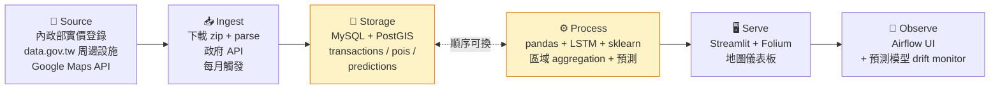

# 情境 8：不動產房價趨勢分析

> **一句話**：給買房 / 投資人「這區域 3 年走勢、現在進場合不合理」的決策工具。

---

## 為誰解什麼

- **目標用戶**：首購族 / 房地產投資人 / 房仲 / 房貸銀行
- **痛點**：實價登錄查得到但沒洞察、區域對比要花一週、預測模型沒人做
- **量化目標**：6 都熱區房價預測 RMSE < 15%；查詢時間從 1 週 → 10 秒

---

## 業界對標

→ 詳見 [04 痛點地圖 - 情境 8](../04-pain-points-industry-map.md#情境-8不動產房價趨勢分析)

**過往學長姐 demo**：
- [14 房價走勢密碼（TJR102）](https://youtu.be/qNotAKYpsP8)
- [15 六都寵物便利度 × 開店潛力分析（TJR103）](https://youtu.be/9pFwC35E__k)

---

## 6 階段藍圖具體化



---

## 資料源細節

| 資料源 | 取得方式 | 規模 | 用來做 |
|---|---|---|---|
| [內政部不動產交易實價查詢](https://lvr.land.moi.gov.tw/) | 每季下載 zip / API | 每季 ~10 萬筆 | 主資料 |
| [data.gov.tw 學區 / 醫院 / 捷運](https://data.gov.tw/) | API / CSV | ~10 萬個 POI | 周邊評分 |
| Google Maps Places API | API（要 key） | 即時周邊 | 校準 |

---

## 10 階段執行重點

### ① 啟動
- 選題理由：人人都關心、資料公開、地理計算 + 時序預測技術雙修
- 注意：實價登錄欄位多，要花時間理解

### ② Discovery
- Persona 範例：30 歲首購族阿銘、預算 1500 萬、看中林口 / 板橋
- 痛點：(1) 不知道現在合理價 (2) 不知道周邊建設 (3) 怕買到下跌區

### ③ 設計
- 區域切分：行政區（粗）vs 學區（細）vs H3 hex
- 預測單位：每月每區坪數均價
- Schema：transactions / pois / region_summary / predictions

### ④ 分工
| 角色 | 任務 |
|---|---|
| Ingest | 實價登錄 zip 解析 + 地址 → 座標 |
| Pipeline | Airflow 每月 + PostGIS 設定 |
| Analytics | 預測模型 + 周邊評分演算法 |
| Product | Streamlit + Folium 互動地圖 |

### ⑤ 環境
- PostGIS 設定要早（docker 化）
- Google Maps API key 注意 quota

### ⑥ 衝刺

**Sprint 1（W10-W12）**：
- 1 個城市（台北）1 季實價登錄 → MySQL
- 簡單地圖（每筆交易一個點）

**Sprint 2（W13-W15）**：
- 6 都全載
- 周邊 POI 整合
- 區域 aggregate + 時序圖

**Sprint 3（W16-W18）**：
- 預測模型（LSTM 或 Prophet）
- 評分系統（區域投資分數）
- 互動地圖 + dashboard

### ⑦ 整合
- 端到端：選地址 → 顯示 (a) 周邊歷史成交 (b) 區域趨勢 (c) 未來 3 年預測
- 整合測試：6 都 5 個熱區都跑通

### ⑧ 上線
- Streamlit Cloud
- PostGIS + Airflow 在 GCP

### ⑨ Demo
殺手 demo：
1. 輸入「板橋區某街某段」→ 顯示完整分析
2. 對比另外兩區 → 推薦
3. 講真實價值：「銀行房貸 AE 給你看的、現在你自己有」

### ⑩ 復盤

---

## 範例：地址 → 座標

```python
# 內政部資料只有「地段地號」要轉成座標
# 方案 1：用 Google Geocoding API（要錢）
# 方案 2：用台灣 TGOS 開放 API（免費）

import requests

def geocode_taiwan(address: str) -> tuple[float, float]:
    """用 TGOS 把地址轉成 (lat, lng)"""
    resp = requests.get(
        "https://api.nlsc.gov.tw/other/...",
        params={"address": address},
    )
    return parse_response(resp)

# 然後寫進 PostGIS
"""
INSERT INTO transactions (id, location, ...)
VALUES (?, ST_SetSRID(ST_MakePoint(lng, lat), 4326), ...)
"""
```

---

## 範例 commit log

```
* feat: parse 內政部實價登錄 zip with proper encoding (#3)
* fix: handle 中文 / English mixed columns in raw CSV (#5)
* feat: PostGIS schema with spatial index (#8)
* feat: address geocoding with TGOS API + caching (#11)
* feat: POI integration (school/MRT/hospital) (#14)
* feat: region price aggregation with monthly buckets (#17)
* feat: Prophet model for 3-year forecast (#20)
* feat: investment score algorithm (#23)
* feat: streamlit + folium interactive map (#26)
```

---

## 進階挑戰

- [ ] **PostGIS 進階**：用 ST_Buffer 算「500m 內捷運站數」
- [ ] **ML 房價預測**：XGBoost + 多 feature
- [ ] **dbt + BigQuery**：把 Process 層重寫
- [ ] **建設預測影響**：捷運完工前後價格變化模型
- [ ] **租屋整合**：加 591 租屋資料看「租金回報率」

---

## 雷區

| 雷 | 為什麼 |
|---|---|
| 用「總價」不用「單坪價」 | 房子大小不同沒法比 |
| 沒去異常值 | 一筆 1 億的會把均價拉爆 |
| 預測沒考慮季節性 | Prophet 有現成 seasonality |
| 地圖點太多 | 用 cluster / heatmap |

---

## 重要：法律與倫理

- 實價登錄是公開資料 ✅
- 不要 publish 個人 / 物件可識別資訊
- 「預測」要標明這是「模型估算」不是「保證價格」
- 不要說「這區一定漲」這種承諾語言

---

## 完整時程（總 20 週）

| 週 | 階段 | 重點產出 |
|---|---|---|
| W1-W3 | 啟動 | 城市範圍選定 |
| W2-W4 | Discovery | 區域切分策略 |
| W4-W7 | 設計 + 分工 | PostGIS 設計 + 模型選型 |
| W10-W12 | Sprint 1 | 台北 1 季 + 簡單地圖 |
| W13-W15 | Sprint 2 | 6 都 + POI + 趨勢 |
| W16-W18 | Sprint 3 | 預測 + 評分 + 互動 |
| W19 | 整合 + 上線 | end-to-end |
| W20 | Demo + 復盤 | 強調買房決策價值 |

---

← [上個情境：7 新聞輿情](scenario-7-news.md) | [回到 README](../README.md)
