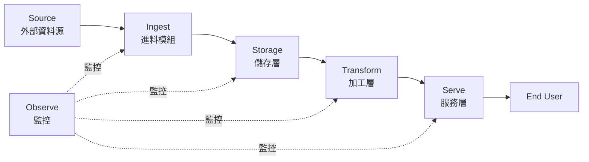

# 系統架構

> 一張圖 + 三段話。能讓「沒看過這個專案」的人在 5 分鐘內看懂。

---

## 整體架構圖



> 或用 draw.io 畫得更精細，匯出 .svg / .png 放在 `docs/img/` 內嵌

---

## 6 階段詳述

### 1. Source — 資料源

| 來源 | 類型 | 更新頻率 | 規模 |
|---|---|---|---|
| {API 1} | REST API | 每小時 | ~1000 筆 / 天 |
| {API 2} | RSS | 即時 | ~100 篇 / 天 |
| {Crawl 1} | 爬蟲 | 每日 | ~5000 筆 / 天 |

### 2. Ingest — 進料

- **工具**：{Python + Airflow / Scrapy}
- **頻率**：{每日 6am / 每小時 / 即時}
- **錯誤處理**：retry 3 次 + 失敗推送 LINE
- **代碼位置**：`src/ingest/`

### 3. Storage — 儲存

- **Raw layer**：{MongoDB / GCS / S3} — 永遠保留，不做任何 mutation
- **Cleaned layer**：{MySQL / PostgreSQL} — 清洗後可查詢
- **Curated layer**：{BigQuery / dbt models} — 給 dashboard 用

ER 圖見 [data-dictionary.md](data-dictionary.md)

### 4. Transform — 加工

- **工具**：pandas / SQL / {dbt / Spark}
- **處理頻率**：{每日 6am / 每小時}
- **代碼位置**：`src/analytics/`
- **單元測試**：`tests/unit/analytics/`

### 5. Serve — 服務

| 介面 | 工具 | 對象 | URL |
|---|---|---|---|
| Dashboard | Streamlit | 內部 / 用戶 | http://... |
| API | FastAPI | 其他系統 | http://.../docs |
| LINE Bot | webhook | 用戶推播 | - |

### 6. Observe — 監控

| 項目 | 工具 | Alert 條件 |
|---|---|---|
| Pipeline 失敗 | Sentry | error rate > 5% |
| API 健康 | Uptime Robot | 5xx > 1% |
| Cost | GCP Billing | 月 > $50 |
| Data freshness | Custom check | 超過 24h 未更新 |

---

## 關鍵決策（ADR 速覽）

| ADR | 標題 | 結論 |
|---|---|---|
| 001 | 選 MongoDB 不選 PostgreSQL | 因 schema 變動頻繁 |
| 002 | 選 Airflow 不選 cron | 因要 DAG 視覺化 + retry |
| 003 | LLM 用 gpt-4o-mini 不用 gpt-4o | cost ÷ 15、精度只少 5% |
| ... | ... | ... |

> 詳細 ADR 見 `docs/adr/` 資料夾

---

## 部署架構

```
GCP Project: project-name
├── Compute Engine: VM 跑 Airflow + MongoDB
├── Cloud Run: FastAPI（auto-scale）
├── Streamlit Cloud: dashboard（免費）
└── Sentry: 監控
```

---

## 擴展性考量

| 維度 | 現在 | 10x scale 怎麼改 |
|---|---|---|
| 資料量 | 1 GB/月 | 從 MongoDB 升 BigQuery |
| 用戶量 | 10 人 | API 加 cache（Redis） |
| 即時性 | 30 分鐘 | 加 Kafka |
| 模型 | 每日 retrain | 加 MLflow tracking |

> 這段是面試常被問的 — 一定要想過
